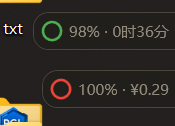
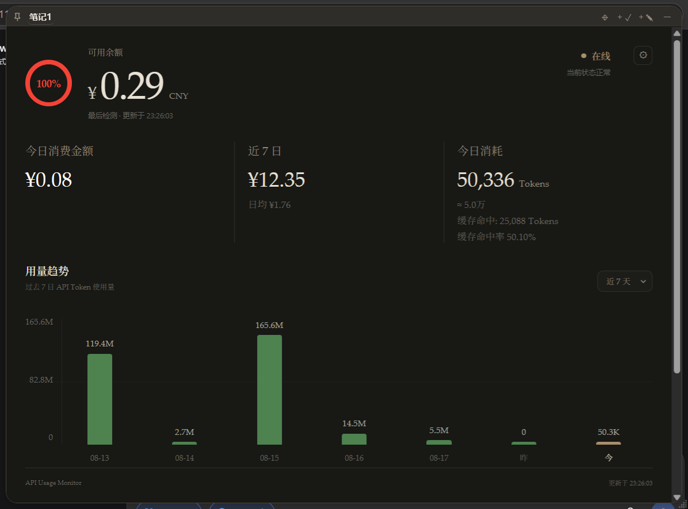
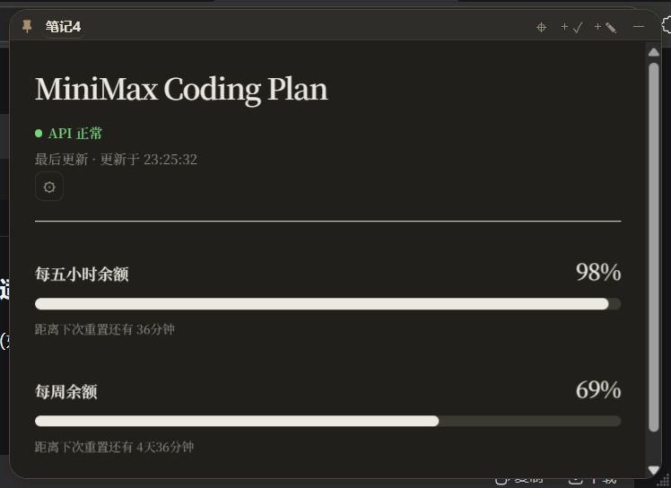
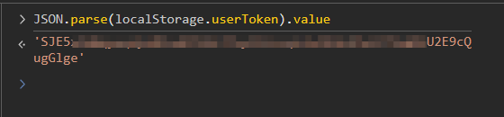

# PaperTodo API 余额监测插件

[PaperTodo](https://github.com/snownico0722/PaperTodo) 的第三方插件,把 API 服务商的**余额 / 用量额度**拉到桌面:胶囊里看圆环和数字,展开看完整监视面板。

目前已适配 **DeepSeek** 和 **MiniMax** 两个供应商;**OpenCode Go** 已预留配置入口,面板暂未实现,切换后会显示"尚未适配该供应商"。会逐步添加对主流供应商的支持，并且对UI设计等内容进行优化。

---

## 它能做什么

### 胶囊视图(一直可见)

- **风险圆环**:余额越低颜色越红,跟着阈值走;阈值未设置时显示灰色。
- **胶囊文字**:
  - DeepSeek:`¥15.96` 或 `21% · ¥15.96`(百分比可在设置里关掉)
  - MiniMax:`7% · 3时45分`(剩余百分比 + 当前周期重置倒计时)
- **折叠后台轮询**:即使胶囊折叠,也会按设定间隔定时刷新。


### 监视面板(点胶囊展开)

- **DeepSeek**
  - 顶部余额圆环 + 状态点 + 末次更新时间
  - 三张指标卡:今日消费(金额 / 模型分布 / 较昨日变化)、近 7 日(日均)、今日 Token(数量 / 缓存命中 / 命中率)
  - 用量趋势柱状图,可下拉切换今天 / 昨天 / 近 7 天 / 近 30 天 / 本月 / 上月 / 自定义时段




- **MiniMax**
  - 两根进度条:**每五小时余额**(interval)+ **每周余额**(weekly)
  - 各自显示百分比 + 重置倒计时
- **多供应商切换**:面板右上角的 ⚙ 按钮,弹出 DeepSeek / MiniMax / OpenCode 列表,当前供应商打勾,点一下就切换并立即重拉数据。**每个胶囊可独立选供应商**。
- **跟随主题**:浅色 / 深色自动切换。

  

---

## 快速上手

1. **首次使用**:新建一张 PaperTodo 纸条,正文类型选「API 余额监测」。
2. **填 API Key**:右键纸条 → 插件设置,在「DeepSeek API Key」一栏粘贴 `sk-…`(DeepSeek 供应商)或在「MiniMax API Key」一栏粘贴 MiniMax Key。留空则跳过对应供应商。
3. **等首次轮询**:胶囊会出现数字和圆环。展开查看完整面板。
4. **切换供应商**:点开监视面板右上角的 ⚙,从下拉里选 DeepSeek 或 MiniMax。**切换是按"每张纸"独立记录的**,不同纸条可以选不同的供应商。

> 💡 DeepSeek 想看今日 Token / 近 7 日消费图表,还需要填「用量 Token」,这是 [platform.deepseek.com](https://platform.deepseek.com) 的用量查询 Token,**不是** API Key。
你需要在[platform.deepseek.com](https://platform.deepseek.com) 中登录你的账户,在页面中点击F12打开开发者工具，在控制台中输入 `JSON.parse(localStorage.userToken).value`，将输出的字符串粘贴到设置中.

  

---

## 设置项

由 PaperTodo 宿主绘制设置页,所有 Key **本地明文存储**(`plugins/data/api.balance.monitor.json`),请自行评估风险。

| 设置项 | 类型 | 说明 |
| --- | --- | --- |
| DeepSeek API Key | string | Bearer 鉴权,只用于 DeepSeek 供应商 |
| MiniMax API Key | string | Bearer 鉴权,只用于 MiniMax 供应商 |
| OpenCode Go API Key | string | 预留,面板暂未实现 |
| 用量 Token(可选) | string | platform.deepseek.com 的用量查询 Token,非 API Key;填写后 DeepSeek 面板显示 Token / 消费柱状图 |
| 刷新间隔 | number(秒) | 15–3600,默认 60 |
| 货币符号 | select | ¥ 人民币 / $ 美元,DeepSeek 胶囊使用 |
| 余额提醒阈值 | number | DeepSeek 胶囊圆环颜色参考值,默认 20 |
| 显示百分比 | boolean | 胶囊是否附加百分比,默认开 |
| MiniView 字体 | string | 覆盖监视面板字体,留空跟随主题;Windows 填字体名(如 `Microsoft YaHei UI`),macOS / Linux 填字形名(如 `PingFang SC` / `Noto Sans CJK SC`) |

---

## 接口连通性测试

仓库附带两个 PowerShell 脚本,用来**只测网络和 Key 是否有效**(不会改 PaperTodo 的任何状态),便于排错:

```powershell
# 从插件数据文件读取 Key;不存在则回退到环境变量
powershell -File Test-DeepSeekBalance.ps1
powershell -File Test-MiniMaxCodingPlan.ps1

# 或者通过环境变量传入,避免命令历史泄露
$env:DEEPSEEK_API_KEY = "sk-..."
powershell -File Test-DeepSeekBalance.ps1
```

---

## 已对接的 API

| 供应商 | 用途 | 地址 |
| --- | --- | --- |
| DeepSeek | 余额 | `https://api.deepseek.com/user/balance` |
| DeepSeek | 用量(可选) | `https://platform.deepseek.com/api/v0/usage/amount` |
| DeepSeek | 消费(可选) | `https://platform.deepseek.com/api/v0/usage/cost` |
| MiniMax | Coding Plan 余额 | `https://www.minimaxi.com/v1/api/openplatform/coding_plan/remains` |

---

## 常见问题

**胶囊一直显示"尚未拉取"?**
- 检查 Key 是否填对(DeepSeek 是 `sk-…` 开头,MiniMax 单独签发)。
- 检查网络是否能访问对应接口(可用上方测试脚本验证)。
- 折叠胶囊是否超过 60 秒?可以右键 → 设置 → 调小"刷新间隔"。

**DeepSeek 面板没有 Token / 消费图表?**
- 「用量 Token」没填,或 Token 已过期。这个 Token 在 [platform.deepseek.com](https://platform.deepseek.com) 的用量页签发,**不是 API Key**。

**切换供应商后没反应?**
- ⚙ 切换是按"每张纸"独立记录的。如果面板是 HTML 重载后还没拉数据,等一个轮询周期即可。
- 切换到 OpenCode 会回到「尚未适配该供应商」状态,这是正常的。

**Key 是明文存储,安全吗?**
- 本插件不加密,文件落在 PaperTodo 的 `plugins/data/api.balance.monitor.json` 下,本机用户权限即可读取。**请勿在共享电脑使用,或自行评估是否接受此风险**。

---

## 版本历史

- **1.2.0**(当前)— 每张纸独立选供应商、⚙ 切换 UI、MiniMax 双进度条面板
- **1.1.0** — DeepSeek / MiniMax 双供应商、HTML 监视面板、缓存命中可视化
- **1.0.0** — DeepSeek 单一余额监测

---

## 许可

仅供学习与个人使用。各供应商 API 的使用需遵守对应服务商的服务条款。